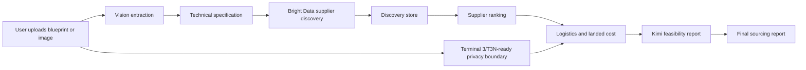

# InstaSource MVP

Autonomous B2B manufacturing and sourcing agent for custom parts.

InstaSource turns a blueprint, product image, or CAD-style part request into a manufacturer shortlist, landed-cost estimate, risk report, and private sourcing record. It is designed for engineers, founders, procurement teams, and hardware companies that need supplier discovery faster than the usual email-heavy RFQ process.

## Short Idea

Custom manufacturing sourcing is slow because technical requirements, supplier capability checks, pricing signals, shipping estimates, and private buyer data are usually handled across scattered emails and spreadsheets.

InstaSource compresses that workflow into one guided run:

1. Upload a part image or blueprint.
2. Extract a clean manufacturing specification.
3. Search public supplier sources through Bright Data.
4. Store discovery evidence in one place.
5. Rank suppliers by capability, cost, timeline, and risk.
6. Keep company and shipping identity masked from the open web.

## Why I Created This

Hardware teams lose days before they even know which suppliers are worth contacting. A mechanical engineer may have a drawing ready, but still needs to:

- describe the part correctly for suppliers,
- find factories that support the right material and process,
- compare capability signals across B2B directories,
- estimate landed cost and customs impact,
- protect private shipping and company identity,
- prepare questions for DFM and quotation review.

InstaSource was created to show how an AI agent can act like a first-pass sourcing analyst: not replacing final procurement approval, but removing the slow first layer of research.

## Purpose

The purpose of this MVP is to demonstrate a live sourcing cockpit:

- Convert visual part input into a technical spec.
- Discover supplier candidates from live web data.
- Keep Bright Data search results in a local discovery store.
- Generate a feasibility report with cost, timeline, risks, and buyer questions.
- Give the user a clear visual view of what the agent is doing while it searches.

## Who Needs It

- Hardware startup founders looking for prototype suppliers.
- Mechanical engineers sourcing CNC, molding, sheet metal, or PCB vendors.
- Procurement teams comparing early-stage manufacturing options.
- Product teams validating whether a custom part is feasible before formal RFQ.
- Hackathon/demo panels evaluating agentic workflows for real-world B2B operations.

## Real-Time Scenario

A founder needs 250 aluminum mechanical keyboard cases made in Aluminum 6061 with black anodizing.

Without InstaSource:

- The founder emails multiple suppliers manually.
- Each supplier asks for missing dimensions, finish, tolerance, MOQ, and shipping details.
- Supplier comparison happens in a spreadsheet.
- Landed cost and customs are checked later.

With InstaSource:

- The founder uploads a drawing or image.
- SenseNova or Kimi extracts the technical specification.
- Bright Data searches supplier directories and public web results.
- The app stores the raw discovery evidence and parsed candidates.
- Kimi creates a feasibility report.
- Daytona-ready logistics logic estimates landed cost.
- Terminal 3/T3N-ready privacy logic masks company and shipping identity.

## Use Cases

- CNC machined aluminum housings, keyboard cases, brackets, gears, and fixtures.
- Injection molded plastic enclosures and prototype parts.
- PCB fabrication supplier discovery.
- Sheet metal fabrication and finishing supplier search.
- Early supplier comparison before a formal RFQ package.
- Hackathon demonstration of multi-provider agent orchestration.

## Possibilities

This MVP can grow into:

- Automated RFQ email generation.
- Supplier outreach and quote tracking.
- CAD parsing for STEP/DXF/PDF drawings.
- Real supplier profile scoring with verified certifications.
- Payment, purchase-order, and approval workflows.
- Deeper Terminal 3 TEE contract execution for private buyer data.
- Daytona sandboxed customs, tax, and shipping calculations.
- Bright Data dataset/pipeline integrations for richer supplier profiles.

## How It Solves the User Problem

The user problem is not only "find suppliers." The real problem is reducing uncertainty quickly.

InstaSource solves this by giving the user:

- a readable technical specification,
- a transparent search trail,
- a stored supplier discovery record,
- ranked supplier options,
- estimated cost and lead time,
- risks and buyer questions,
- privacy-safe handling of shipping/company data.

The result is a faster first sourcing decision: which suppliers look worth contacting, what needs verification, and what risk exists before spending time on formal RFQs.

## Product Flow



## Provider Map

| Provider | Role in InstaSource | Current MVP Behavior | Env Vars |
| --- | --- | --- | --- |
| SenseNova | Vision/spec extraction | OpenAI-compatible vision call when configured | `SENSENOVA_API_KEY`, `SENSENOVA_API_URL`, `SENSENOVA_MODEL` |
| Kimi / Moonshot | Vision fallback and report generation | Generates structured feasibility report JSON | `KIMI_API_KEY`, `KIMI_BASE_URL`, `KIMI_MODEL`, `KIMI_REPORT_MODEL` |
| Bright Data | Supplier discovery | Fetches public search/directory pages and stores evidence | `BRIGHT_DATA_API_KEY` or `BRIGHTDATA_API_KEY` |
| Daytona | Secure calculation boundary | Local landed-cost logic with Daytona-ready config boundary | `DAYTONA_API_KEY`, `DAYTONA_API_URL` |
| Terminal 3 / T3N | Private identity boundary | Masks buyer identity locally; ready for SDK contract execution | `TERMINAL3_API_KEY` or `T3N_API_KEY`, `TERMINAL3_ENVIRONMENT` |

## Documentation Map

| Topic | File |
| --- | --- |
| App entrypoint and HTTP routes | `server.js` |
| Runtime configuration and env loading | `src/config.js` |
| End-to-end sourcing pipeline | `src/pipeline.js` |
| Vision extraction provider | `src/providers/vision.js` |
| Bright Data supplier discovery | `src/providers/suppliers.js` |
| Kimi feasibility report | `src/providers/analysis.js` |
| Logistics and landed-cost estimate | `src/providers/logistics.js` |
| Terminal 3/T3N-ready privacy masking | `src/providers/privacy.js` |
| Discovery persistence | `src/discovery-store.js` |
| Supplier ranking and scoring | `src/utils/scoring.js` |
| Browser UI markup | `public/index.html` |
| Browser UI behavior | `public/app.js` |
| Browser UI design | `public/styles.css` |
| Demo/sample blueprint visual | `public/sample-part.svg` |
| Environment variable template | `.env.example` |

## Project Structure

```text
instasource-mvp/
  server.js
  package.json
  README.md
  .env.example
  public/
    index.html
    app.js
    styles.css
    sample-part.svg
  src/
    config.js
    discovery-store.js
    http.js
    pipeline.js
    data/
      mock-suppliers.js
    providers/
      analysis.js
      logistics.js
      privacy.js
      suppliers.js
      vision.js
    utils/
      scoring.js
```

Runtime-generated discovery records are stored in:

```text
.instasource/discoveries.json
```

## Run Locally

```bash
cd instasource-mvp
cp .env.example .env
npm start
```

Open:

```text
http://127.0.0.1:4123
```

If you are already running on another port, set `PORT` in `.env`.

## Environment Variables

```env
HOST=127.0.0.1
PORT=4123
LIVE_ONLY=true
FALLBACK_TO_MOCK=true

SENSENOVA_API_KEY=
SENSENOVA_API_URL=https://token.sensenova.cn/v1
SENSENOVA_MODEL=SenseNova-U1

KIMI_API_KEY=
KIMI_BASE_URL=https://api.moonshot.ai/v1
KIMI_MODEL=kimi-k2.6
KIMI_REPORT_MODEL=moonshot-v1-8k
KIMI_TIMEOUT_MS=20000
KIMI_MAX_TOKENS=2000
KIMI_THINKING=disabled

BRIGHT_DATA_API_KEY=
BRIGHTDATA_API_KEY=
BRIGHT_DATA_ZONE=
BRIGHTDATA_UNLOCKER_ZONE=
BRIGHTDATA_SERP_ZONE=
BRIGHT_DATA_ENDPOINT=https://api.brightdata.com/request
BRIGHT_DATA_TIMEOUT_MS=12000

DAYTONA_API_KEY=
DAYTONA_API_URL=https://app.daytona.io

TERMINAL3_API_KEY=
T3N_API_KEY=
TERMINAL3_ENVIRONMENT=testnet
```

Notes:

- Bright Data zone is optional in this MVP. The app attempts discovery with only the API key.
- `FALLBACK_TO_MOCK=true` keeps the demo working when a live API times out, rejects a model, or requires extra setup.
- SenseNova base URLs ending in `/v1` are normalized to `/v1/chat/completions`.
- Terminal 3 does not use `TERMINAL3_ACTION_URL`; real production execution should use `@terminal3/t3n-sdk`, registered contracts, and contract invocation.

## API Reference

### Health

```http
GET /api/health
```

Returns provider status and setup warnings.

### Run Sourcing Analysis

```http
POST /api/source
```

Example request:

```json
{
  "partName": "Aluminum mechanical keyboard case",
  "quantity": 250,
  "materialHint": "Aluminum 6061",
  "processHint": "CNC machining",
  "finishHint": "Black anodized",
  "toleranceHint": "+/- 0.10 mm",
  "destinationCountry": "US",
  "destinationPostal": "94107",
  "companyName": "Acme Hardware",
  "shippingAddress": "1 Market Street, San Francisco, CA 94107",
  "fileName": "case.png",
  "mimeType": "image/png",
  "fileBase64": "..."
}
```

Response includes:

- `specification`
- `discovery`
- `suppliers`
- `allCandidates`
- `logistics`
- `privacy`
- `report`
- `nextActions`

### Discovery Store

```http
GET /api/discoveries
```

Returns a list of stored Bright Data discovery runs.

```http
GET /api/discoveries/:id
```

Returns one full discovery record with query, sources, documents, and parsed candidates.

## UI Guide

The browser UI is built as a sourcing cockpit:

- Left rail: provider status and pipeline progress.
- Intake panel: blueprint/image upload and part requirements.
- Search visual: animated radar and step-by-step sourcing progress.
- Bright Data discovery board: query, fetched sources, and parsed candidate count.
- Report panel: feasibility, cost range, timeline, confidence, logistics, ranked manufacturers, risks, and buyer questions.
- Discovery store: recent Bright Data runs saved in one place.

## Current Limitations

- The app does not send RFQ emails yet.
- Supplier results are parsed from public search text and still require verification.
- Customs, duties, and logistics are estimates, not final trade compliance advice.
- Terminal 3 is prepared as a privacy boundary but does not yet execute a real T3N contract.
- Daytona is represented as a secure calculation boundary; deeper sandbox execution can be added next.

## Demo Pitch

InstaSource is an AI sourcing cockpit for hardware teams. Upload a part, and the agent extracts the spec, searches live supplier sources, stores the evidence, ranks manufacturers, estimates landed cost, and produces a sourcing feasibility report while protecting buyer identity.

## Production Roadmap

1. Add supplier outreach and RFQ email drafting.
2. Add verified supplier profiles and certification checks.
3. Add real CAD/PDF dimension extraction.
4. Add Terminal 3 contract execution for private identity and delegated actions.
5. Add Daytona sandbox jobs for customs, duty, tax, and freight calculations.
6. Add quote comparison, approval workflow, and purchase-order handoff.

## Safety and Compliance

InstaSource is a decision-support tool. It should not automatically place orders or transmit private buyer data to suppliers without explicit approval. All public supplier data, estimated costs, duties, and lead times should be verified before procurement action.
